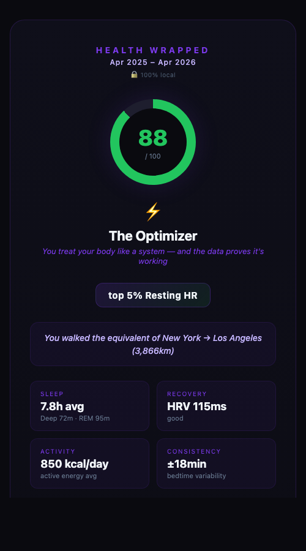

# aveil-health

Your Apple Health data, analyzed locally via CLI.

One command to turn your data into a clear report — sleep stages, recovery readiness, activity trends, and nutrition signals (if you track food). Everything runs on your machine. Nothing leaves it.

## Sleep & recovery consult brief

Generate a narrow, anomaly-first consult brief for sleep and recovery:

```bash
npx aveil-health brief export.zip --output examples/output/appointment-brief.html
```

The brief leads with four concrete questions above the fold:
- what changed
- why it matters
- what to ask
- what to test next

It is intentionally not a generic wellness report. The artifact is designed to help a sleep/recovery consult start with the anomaly instead of a score.

Canonical launch assets in this repo:
- `examples/output/appointment-brief.html`
- `examples/output/appointment-brief.png`

## Health Wrapped

Generate a shareable card (think Spotify Wrapped, but for your health):

```bash
npx aveil-health wrapped export.zip
```

Opens a dark-mode card in your browser with your score, health identity, stats, and signals.

<p align="center">
  
</p>

## Get Started

### 1. Export your Apple Health data

On your iPhone:

1. Open the **Health** app
2. Tap your **profile picture** (top right)
3. Scroll down → **Export All Health Data**
4. Tap **Export** (this takes a minute — it's zipping everything)
5. AirDrop or save the `.zip` to your computer

> The file can be 50–500MB+ depending on how long you've had an Apple Watch. That's fine — the parser streams through it without loading everything into memory.

### 2. Run it

```bash
# Full analysis
npx aveil-health analyze export.zip

# Just the last 2 weeks
npx aveil-health analyze export.xml --days 14

# JSON output (pipe to jq, save, feed to other tools)
npx aveil-health analyze export.xml --json > report.json

# Sleep & recovery consult brief
npx aveil-health brief export.zip

# Save the consult brief to a custom path
npx aveil-health brief export.zip --output ~/Desktop/sleep-recovery-brief.html

# Wrapped card
npx aveil-health wrapped export.zip

# Generate demo cards for all archetypes
npx aveil-health demo
```

That's it. No install, no config, no signup.

## What you get

```
  ▲ AVEIL  Health Analysis
  ─────────────────────────────────────

  Overall Score: 86/100
  sleep 99 · recovery 74 · activity 100

  ■ SLEEP
  Last night: 7.2h total
  Deep 87m · REM 111m · Core 231m · Awake 31m

  14-night avg: 7.5h · deep 52m · REM 96m
  Avg bedtime: 9:00 PM · variability ±24min
  Trend: 📈 improving

  ■ RECOVERY
  Score: 74/100 (good)
  HRV: 120ms (avg 109.5ms) · RHR 49bpm
  Trend: 📈 improving

  ■ ACTIVITY
  Today: 11,045 steps · 634 kcal
  14-day avg: 13,648 steps/day · 738 kcal/day
  Recent workouts: Strength Training (34min), Walking (28min)
  Trend: 📉 declining

  ■ NUTRITION
  14-day avg: 1,676 kcal · 133g protein

  ■ SIGNALS
  ✅ Sleep: 7.2h (good)
     → Sleep looks solid — maintain current routine

  ✅ Recovery: 74/100 (good)
     → Good to push — recovery supports hard training today

  ─────────────────────────────────────
  77,186 records analyzed
  aveilx.com
```

## Signals

Signals are the point — not dashboards, but concrete observations with next steps:

- **Sleep quality** — duration + stage breakdown + what to change
- **Deep sleep deficit** — when your deep sleep average drops below 45 min
- **Recovery readiness** — HRV-based, tells you to push or rest
- **Activity alerts** — when daily movement drops below health thresholds
- **Protein lag** — when tracked protein falls short

Each signal has a severity (`positive` / `neutral` / `warning`) and a specific action.

## MCP Server

Give your AI agent a health context. Add to your MCP config (Claude Code, OpenClaw, Codex, etc.):

```json
{
  "mcpServers": {
    "aveil-health": {
      "command": "npx",
      "args": ["aveil-health", "mcp"],
      "env": {
        "AVEIL_HEALTH_EXPORT": "/path/to/your/export.xml"
      }
    }
  }
}
```

Then just ask:

- *"How did I sleep last night?"*
- *"Am I recovered enough to train hard today?"*
- *"What should I focus on to improve my sleep?"*

Available tools: `analyze_health`, `get_sleep_summary`, `get_recovery_status`, `get_activity_summary`, `get_signals`, `get_recommendations`

Works with Claude Code, Cursor, Codex, OpenClaw, Windsurf, Cline — anything that speaks MCP.

## Privacy

- **100% local** — parsed and analyzed on your machine
- **Zero network calls** — no APIs, no telemetry, no tracking
- **No account** — just your export file
- **Open source** — verify every line, fork it, make it yours

## Requirements

- Node.js 18+
- Apple Health export (iPhone for export, Apple Watch recommended for full data)

## Roadmap

- [ ] Aveil app integration
- [ ] Trend visualizations (terminal sparklines)
- [ ] Weekly digest mode
- [ ] Custom signal thresholds
- [ ] Garmin / Fitbit / Google Health support

## License

MIT

---

Built by [@alexalexxss](https://github.com/alexalexxss) · [aveilx.com](https://aveilx.com)
